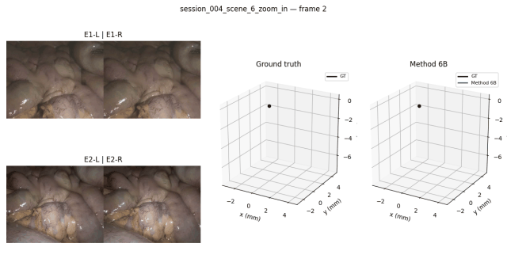
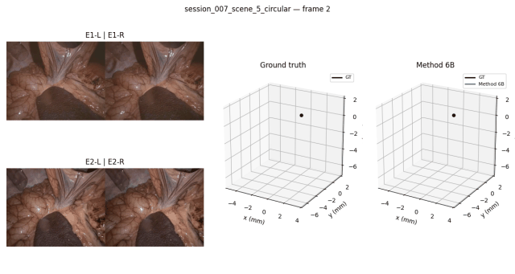

# iMED-PE Challenge Methods

Research code for multi-view camera pose estimation developed for the
[iMED Pose Estimation Challenge](https://imed-challenge.github.io/). The
repository contains classical stereo geometry, visual odometry, learned
correspondence front ends, robust trajectory fusion, and a reliability-routed
mixture of pose experts.

The dataset, generated predictions, calibration caches, and third-party model
weights are not included. The two qualitative examples below are published
with permission from the challenge organizers.

## Final result

Our selected method is **Method 6B**, which routes three complementary absolute
pose experts using inference-time geometric diagnostics and fuses their soft
reliability-weighted observations with temporal stereo VO. On the 19-sequence
released TEST split it achieved:

| Mean ATE | Session-balanced ATE | Worst-session ATE | Frame p95 |
|---:|---:|---:|---:|
| **1.1357 mm** | **1.1663 mm** | **2.0296 mm** | **3.0973 mm** |

These values use the challenge-compatible trajectory-level Sim(3) alignment.
They are released-split results, not a claim about the final hidden ranking.

## Qualitative results

Each grid synchronizes the two stereo endoscopes with the
ground-truth and Method 6B trajectories after the same Sim(3) alignment used
for evaluation.

| Representative sequence | Difficult sequence |
|:---:|:---:|
|  |  |
| `session_004_scene_6_zoom_in` | `session_007_scene_5_circular` |

The exact generation commands are under
[get-grids](#publication-style-grids). Full-resolution stills
are stored beside the GIFs for use in papers and presentations.

## Implemented methods

| Name | Summary |
|---|---|
| Baseline | ALIKED + LightGlue cross-endoscope essential matrix |
| Method 1 | Endoscope-2 stereo visual odometry with temporal PnP |
| Method 1.5A | Method 1 with independent cross-endoscope rotation anchors |
| Method 2A | Per-frame E1 stereo reconstruction to E2-L PnP |
| Method 2B | Reverse per-frame E2 stereo reconstruction to E1-L PnP |
| Method 3A/3B | Zero-shot VGGT four-view and reference-anchored eight-view poses |
| Method 4A | Robust fusion of Method 2A/2B absolute poses and Method 1 VO edges |
| XFeat | Sparse-XFeat front-end ablations and XFeat-calibrated Method 4A |
| EfficientLoFTR | Pairwise and pure three-view LoFTR experiments for Method 2/4A |
| RoMa-2A | Exact-index ALIKED source pixels warped into E1-R and E2-L by full RoMa |
| Method 5-R | Geometry-only E1 stereo correction followed by RoMa-2A and frozen Method 4A |
| **Method 6B** | **Soft reliability routing of Method 2A, Method 2B, and LoFTR-2A inside the VO-constrained fusion optimizer** |

Each method can be run independently; there is no requirement to execute every
experiment. See [`docs/METHODS.md`](docs/METHODS.md) for concise explanations
and [`docs/RUN_METHODS.md`](docs/RUN_METHODS.md) for prerequisites and
copy-paste commands for trying the different pipelines.

Method 6B is the best released (internal) Test method in this repository. It improves
mean ATE, session-balanced ATE, worst-session ATE, and frame-p95 error over the
original Method 4A and 4A + LoFTR-2A. The full ablation is documented in
[`docs/METHOD6_RESULTS.md`](docs/METHOD6_RESULTS.md).

The exact transform conventions are documented in
[`docs/TRANSFORMS.md`](docs/TRANSFORMS.md). Frozen experiment settings are in
[`configs/`](configs/).

## Repository layout

```text
configs/        frozen method settings
docs/           dataset contract, methods, results, and reproducibility notes
environments/   separate VGGT environment
experiments/    XFeat, EfficientLoFTR, RoMa, Method 5-R/6, and LOSO code
models/         small project-trained artifacts (currently the Method 6 router)
scripts/        calibration, inference, evaluation, and visualization CLIs
src/imcpe/      shared geometry and method implementations
tests/          dependency-free/synthetic safety checks
third_party/    revision manifest and setup helper (no vendored weights)
```

## Installation

The local research runs used the `pe-basline` Python 3.10 uv environment,
captured by the root lockfile. Challenge Docker runs used the smaller CUDA 11.8
stack recorded separately in `environments/docker/`. Install
[uv](https://docs.astral.sh/uv/) and run:

```bash
git clone https://github.com/danushkv/iMED-pe_challenge.git
cd iMED-pe_challenge
uv sync --extra dev
uv run python scripts/check_install.py
```

For exact reproduction after cloning, prefer `uv sync --extra dev --frozen`.

The committed `uv.lock` fixes the Python dependency graph. Model source and
weights are handled separately because they have their own licenses:

```bash
bash third_party/setup_models.sh --lightglue
bash third_party/setup_models.sh --xfeat
bash third_party/setup_models.sh --loftr
bash third_party/setup_models.sh --roma
```

The helper clones exact commits and explains where an official checkpoint must
be placed. It does not silently download license-gated files. See
[`THIRD_PARTY.md`](THIRD_PARTY.md).

Cache the official ALIKED/LightGlue weights explicitly before offline use:

```bash
uv run python scripts/cache_lightglue_weights.py --max-keypoints 2048
```

VGGT is deliberately isolated because its current dependency requirements are
newer than the evaluated classical stack:

```bash
cd environments/vggt
uv sync
cd ../..
bash third_party/setup_models.sh --vggt
```

## Dataset format

Pass the dataset at runtime; never edit source paths. The expected layout is:

```text
<DATA_ROOT>/
  train/<sequence>/
  test/<sequence>/
```

Each sequence contains `K.txt`, optional evaluation-only `pose.txt`, and:

```text
endoscope1/L/frame_XXXXXX.png
endoscope1/R/frame_XXXXXX.png
endoscope2/L/frame_XXXXXX.png
endoscope2/R/frame_XXXXXX.png
```

Validate a local dataset without running a model:

```bash
uv run python scripts/validate_dataset.py --data-root /path/to/imed_pe
```

More detail is in [`docs/DATASET.md`](docs/DATASET.md).
Full provenance and fresh-clone checks are in
[`docs/REPRODUCIBILITY.md`](docs/REPRODUCIBILITY.md).

## Reproduce the main result: Method 6B

All examples use shell variables so no machine-specific path enters the code:

```bash
export IMEDPE_DATA_ROOT=/path/to/imed_pe
export IMEDPE_OUTPUT_ROOT=/path/to/generated_outputs
```

Method 6B consumes original Method 1, Method 1.5A rotations, Method 2A,
Method 2B, and EfficientLoFTR-2A predictions plus their inference diagnostics.
Run those frozen prerequisites using [`docs/RUN_METHODS.md`](docs/RUN_METHODS.md),
then build target-free router features and apply the bundled TRAIN-fitted
router:

```bash
uv run python -m experiments.method6_router_ensemble.build_dataset \
  --data-root "$IMEDPE_DATA_ROOT" \
  --split test \
  --expert 2a="$IMEDPE_OUTPUT_ROOT/method2a/pure" \
  --expert 2b="$IMEDPE_OUTPUT_ROOT/method2b" \
  --expert loftr="$IMEDPE_OUTPUT_ROOT/loftr_mv/method2a" \
  --method1-root "$IMEDPE_OUTPUT_ROOT/method1" \
  --rotation-root "$IMEDPE_OUTPUT_ROOT/method1_5" \
  --e1-calibration-diagnostics "$IMEDPE_OUTPUT_ROOT/calibration/e1" \
  --e2-calibration-diagnostics "$IMEDPE_OUTPUT_ROOT/calibration/e2" \
  --output-root "$IMEDPE_OUTPUT_ROOT/method6/dataset_test"

uv run python -m experiments.method6_router_ensemble.predict_final \
  --dataset-root "$IMEDPE_OUTPUT_ROOT/method6/dataset_test" \
  --router-root models/method6 \
  --output-root "$IMEDPE_OUTPUT_ROOT/method6/method6b"
```

The bundled `router.pkl` reproduces the selected scikit-learn model; the
version-independent `router.npz`/`router.json` export is provided for deployment.
To rebuild the router from TRAIN rather than use the frozen artifact, follow the
strict physical-session LOSO and all-TRAIN commands in
[`docs/RUN_METHODS.md`](docs/RUN_METHODS.md). Commands for every other method
are documented there as well.

## Evaluation

Evaluation uses the repository's challenge-compatible Horn/Sim(3) alignment,
ATE, and RPE implementation:

```bash
uv run python scripts/evaluate_ate.py \
  --data-root "$IMEDPE_DATA_ROOT" \
  --split train \
  --pred-root "$IMEDPE_OUTPUT_ROOT/method4a1"
```

### Ouput grid visualization

Create a compact README GIF, a full-resolution still, and an MP4 with
synchronized endoscope frames and aligned Method 6B trajectories:

```bash
uv run python scripts/make_comparison_video.py \
  --sequence-dir "$IMEDPE_DATA_ROOT/train/<sequence>" \
  --prediction "Method 6B=$IMEDPE_OUTPUT_ROOT/method6/method6b/train/<sequence>/pose.txt" \
  --output "$IMEDPE_OUTPUT_ROOT/figures/<sequence>.mp4" \
  --still-output "assets/examples/<sequence>.png" \
  --gif-output "assets/examples/<sequence>.gif" \
  --gif-every 1 \
  --gif-width 640
```

Only the curated PNG/GIF files under `assets/examples/` are versioned. Generated
MP4 files and arbitrary dataset images remain ignored. Result provenance and
the complete comparison tables are in [`docs/RESULTS.md`](docs/RESULTS.md).

## Checkpoints

Exact model variants, filenames, evaluated source revisions, official download
links, expected local paths, and recorded SHA-256 hashes are listed in
[`docs/CHECKPOINTS.md`](docs/CHECKPOINTS.md). Third-party weights are not
redistributed here. The small TRAIN-fitted Method 6 router is included under
`models/method6/` in both exact and version-independent formats.

## License

Original contributions are released under the [MIT License](LICENSE).
Third-party projects and weights retain their own terms; see
[`THIRD_PARTY.md`](THIRD_PARTY.md) and [`NOTICE`](NOTICE). The upstream baseline
currently does not publish a license, so baseline-derived files require the
organizers' redistribution permission and are not relicensed by this project.

## Citation

If this code helps your work, please **cite us and star the repository**:

```bibtex
@software{imed_pe_challenge_methods_2026,
  author  = {{iMED-PE Challenge Methods contributors}},
  title   = {iMED-PE Challenge Methods: Multi-View Endoscopic Pose Estimation},
  year    = {2026},
  version = {0.1.0},
  url     = {https://github.com/danushkv/iMED-pe_challenge}
}
```

Use of the dataset must additionally acknowledge and cite the official iMED
Challenge and its dataset/challenge paper when that citation is provided by the
organizers:

```bibtex
@misc{imed_challenge_2026,
  author = {{iMED Challenge Organizers}},
  title  = {iMED Challenge 2026},
  year   = {2026},
  url    = {https://imed-challenge.github.io/}
}
```

Citing this software does not replace the dataset citation or its terms of use.
